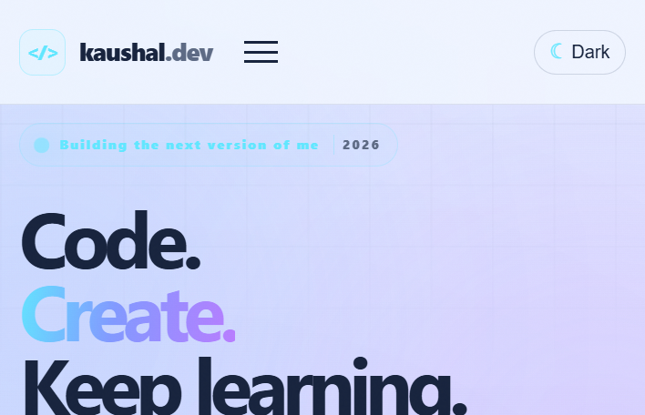

# Kaushal Karn Portfolio

A futuristic personal portfolio built with Django. The site presents Kaushal Karn's skills, learning journey, projects, and contact form through a responsive glassmorphism interface with dark/light theme selection.

## Project Preview



**Documentation navigation:** [Project overview](README.md) · [Command reference](command.md) · [Beginner guide](detail.md) · [Complete reference](complete_detail.md)

For a beginner-friendly setup and deployment walkthrough, read the [complete project guide](detail.md).

## Documentation

- [Command reference](command.md): setup, development, database, testing, static files, admin, and deployment commands.
- [Beginner project guide](detail.md): installation, email setup, deployment modes, troubleshooting, and learning path.
- [Complete learning reference](complete_detail.md): full architecture, feature history, commands used, and beginner-to-advanced roadmap.
- [.env.example](.env.example): safe environment configuration template.
- [Django settings](config/settings.py): project configuration, database, static files, security settings, and email backend.
- [Portfolio models](portfolio/models.py): skills, projects, and contact messages.
- [Portfolio URLs](portfolio/urls.py): public page and form routes.
- [Seed command](portfolio/management/commands/seed_portfolio.py): starter skills and projects.

## Features

- Django-powered portfolio homepage and project detail pages.
- Skills grouped by category with confidence bars.
- Project cards with category filtering and case-study pages.
- Responsive navigation with active section highlighting.
- Persistent dark/light mode preference using browser local storage.
- Scroll-reveal animations, cursor glow, ambient background, and reduced-motion support.
- Contact form that stores messages through Django's ORM.
- Django admin for managing projects, skills, and contact messages.
- SQLite database for local development.
- No frontend framework or build step required.

## Technology

- Python
- Django
- SQLite
- HTML templates
- CSS custom properties and responsive CSS
- Vanilla JavaScript

## Project Structure

```text
.
├── [config/](config/)              # Django project configuration
│   ├── [settings.py](config/settings.py) # Settings and environment configuration
│   ├── [urls.py](config/urls.py)   # Root URL configuration
│   ├── [asgi.py](config/asgi.py)   # ASGI deployment entry point
│   └── [wsgi.py](config/wsgi.py)   # WSGI deployment entry point
├── [portfolio/](portfolio/)        # Main Django application
│   ├── [models.py](portfolio/models.py) # Skill, Project, and ContactMessage models
│   ├── [views.py](portfolio/views.py) # Homepage, contact, and project detail views
│   ├── [forms.py](portfolio/forms.py) # Contact form definition
│   ├── [urls.py](portfolio/urls.py) # Application routes
│   ├── [admin.py](portfolio/admin.py) # Admin registrations
│   └── [management/commands/seed_portfolio.py](portfolio/management/commands/seed_portfolio.py) # Starter data command
├── [templates/portfolio/](templates/portfolio/) # Shared and page-specific templates
├── [static/css/style.css](static/css/style.css) # Visual system and responsive styles
├── [static/js/app.js](static/js/app.js) # Theme, navigation, filters, and animations
├── `staticfiles/`                  # Generated by collectstatic; do not edit
├── `db.sqlite3`                    # Local database; ignored by Git
├── [manage.py](manage.py)          # Django command-line entry point
├── [requirements.txt](requirements.txt) # Python dependencies
├── [command.md](command.md)        # Detailed command guide
├── [detail.md](detail.md)          # Beginner setup and email guide
├── [complete_detail.md](complete_detail.md) # Full learning reference
└── [README.md](README.md)          # Project overview and navigation
```

## Quick Start

### Windows PowerShell

```powershell
python -m venv venv
.\venv\Scripts\Activate.ps1
python -m pip install --upgrade pip
python -m pip install -r requirements.txt
python manage.py migrate
python manage.py seed_portfolio
python manage.py createsuperuser
python manage.py runserver
```

### Linux or macOS

```bash
python3 -m venv venv
source venv/bin/activate
python -m pip install --upgrade pip
python -m pip install -r requirements.txt
python manage.py migrate
python manage.py seed_portfolio
python manage.py createsuperuser
python manage.py runserver
```

Open the site at [http://127.0.0.1:8000/](http://127.0.0.1:8000/) and the admin at [http://127.0.0.1:8000/admin/](http://127.0.0.1:8000/admin/).

## Main Routes

| Route | Purpose |
| --- | --- |
| `/` | Portfolio homepage |
| `/projects/<slug>/` | Project case-study page |
| `/contact/` | Contact form POST endpoint |
| `/admin/` | Django administration |

## Content Management

Run `python manage.py seed_portfolio` to create or update the starter skills and projects. The command uses `update_or_create`, so it can be run repeatedly without creating duplicate seed records.

For ongoing content changes, use the Django admin. Projects support titles, slugs, descriptions, categories, comma-separated technologies, GitHub/live URLs, featured ordering, and display ordering. Skills support names, categories, confidence levels, and ordering. Contact messages are stored with timestamps and read status.

## Development Notes

- Edit page markup in [templates/portfolio/home.html](templates/portfolio/home.html) and [templates/portfolio/project_detail.html](templates/portfolio/project_detail.html).
- Edit the shared shell and navigation in [templates/portfolio/base.html](templates/portfolio/base.html).
- Edit visual design and responsive behavior in [static/css/style.css](static/css/style.css).
- Edit theme persistence, filters, navigation state, and animations in [static/js/app.js](static/js/app.js).
- After changing models, create and apply migrations before running the application.
- The development email backend prints confirmation emails to the console; it does not send real email.

### Email Configuration

The contact form saves each message and sends the visitor a thank-you email. Local development uses Django's console backend. Configure SMTP through environment variables when real delivery is required:

```text
EMAIL_BACKEND=django.core.mail.backends.smtp.EmailBackend
EMAIL_HOST=smtp.example.com
EMAIL_PORT=587
EMAIL_HOST_USER=your-smtp-user
EMAIL_HOST_PASSWORD=your-smtp-password
EMAIL_USE_TLS=True
EMAIL_USE_SSL=False
DEFAULT_FROM_EMAIL=Kaushal Karn <you@example.com>
CONTACT_RECEIVER_EMAIL=kkarn02977@gmail.com
SITE_URL=https://your-domain.example
```

Keep these values in `.env` or your hosting provider's secret configuration. Never commit credentials.

## Validation

Before sharing changes, run:

```powershell
python manage.py check
python manage.py makemigrations --check --dry-run
python manage.py test
python manage.py collectstatic --noinput
```

For a production assessment, also run:

```powershell
python manage.py check --deploy
```

See [command.md](command.md) for explanations and Linux/macOS equivalents.

## Deployment Checklist

This repository is configured primarily for local development. Before deployment:

- Set `DEBUG=False`.
- Load `SECRET_KEY` from an environment variable.
- Configure explicit production `ALLOWED_HOSTS`.
- Use a production database instead of local SQLite where appropriate.
- Configure a real email backend for the contact workflow.
- Configure HTTPS redirects, secure cookies, HSTS, and trusted origins.
- Install and configure a production WSGI or ASGI server.
- Run migrations and `collectstatic` during deployment.
- Run `check --deploy` and resolve all warnings.
- Add automated tests for contact submission, routes, models, and project filtering.

## Personal Content

The included starter content describes a BSc CSIT student at Mahendra Morang Aadarsh Multiple Campus, Tribhuvan University, based in Biratnagar, Nepal. It highlights Python, C++, JavaScript, HTML, CSS, Django, WordPress, ecommerce, machine learning, and web-development projects.

**Continue exploring:** [Command reference](command.md) · [Beginner guide](detail.md) · [Complete reference](complete_detail.md) · [Back to project overview](README.md)
